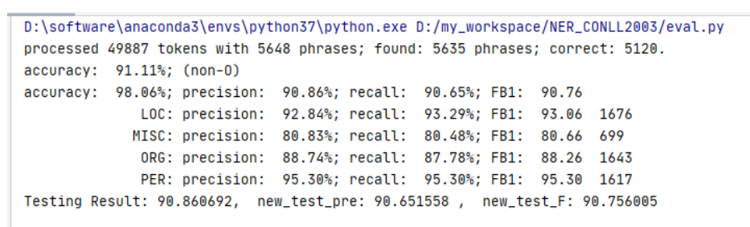

## 任务四：基于LSTM+CRF的序列标注

用LSTM+CRF来训练序列标注模型：以Named Entity Recognition为例。

1. 参考
   1. 《[神经网络与深度学习](https://nndl.github.io/)》 第6、11章
   2. https://arxiv.org/pdf/1603.01354.pdf
   3. https://arxiv.org/pdf/1603.01360.pdf
2. 数据集：CONLL 2003，https://www.clips.uantwerpen.be/conll2003/ner/
3. 实现要求：Pytorch
4. 知识点：
   1. 评价指标：precision、recall、F1
   2. 无向图模型、CRF
5. 时间：两周

## 代码说明

Dataset： 包括训练集、测试集和验证集，以及字符表示加载的预训练词嵌入文件。
Result：包含存储的训练完成的模型、测试集的预测结果
Util：一些相关代码和配置文件，包括数据加载相关，模型结构，配置参数文件等
Reademe：代码的运行方式等说明
Train: 项目的训练代码
Eval: 项目的测试代码，需要训练好的模型或者保存好的结果文件  

## usage:

训练：python3 train.py
测试：python3 eval.py
ps：一些参数可以在 Util/config.yaml修改，也可以通过命令行的参数附加，例如： python3
train.py -config Util/config.yaml 来选择参数文件  

## performance

f1 91.00%

评测脚本：https://github.com/sighsmile/conlleval

  

## reference:

参考论文：

Ma X, Hovy E. End-to-end sequence labeling via bi-directional lstm-cnns-crf[J]. arXiv preprint arXiv:1603.01354, 2016.
Lample G, Ballesteros M, Subramanian S, et al. Neural architectures for named entity recognition[J]. arXiv preprint arXiv:1603.01360, 2016.  

参考代码：
https://github.com/glample/tagger

https://github.com/Franck-Dernoncourt/NeuroNER
https://github.com/ZhixiuYe/NER-pytorch
https://github.com/deepmipt/ner
https://github.com/Determined22/zh-NER-TF
https://github.com/zjy-ucas/ChineseNER
https://github.com/yanwii/ChinsesNER-pytorch
https://github.com/lemonhu/NER-BERT-pytorch
https://github.com/macanv/BERT-BiLSTM-CRF-NER  

用到的数据：

https://nlp.stanford.edu/projects/glove/
https://www.clips.uantwerpen.be/conll2003/ner/
https://github.com/sighsmile/conlleval  

